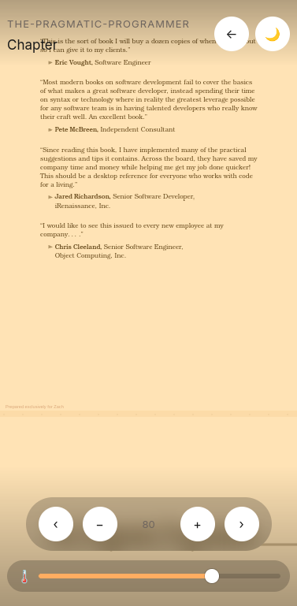

# Ebook Reader

A fast, native ebook reader you can launch with one click — built with Tauri.

## Features

- Clean, native reading interface
- Lightweight — built with Tauri (Rust backend + web frontend), not Electron
- Import and read EPUB and PDF files
- Library view with search by title/author
- Adjustable zoom and a warmth/brightness slider for comfortable reading
- Light/dark mode toggle
- Cross-platform: Linux, Windows, macOS, and Android

## Screenshots

| Library (empty) | Library |
| --- | --- |
|  |  |

| Reading view | Reading view (compact) |
| --- | --- |
|  |  |

## Installation

### Download (recommended)

Grab the latest release for your platform from the [Releases page](https://github.com/bizkda/Ebook-reader/releases).

- **Linux:** `.deb` (Debian/Ubuntu) or `.rpm` (Fedora/RHEL/openSUSE). Arch/other distros — use the install script below.
- **Windows:** `.msi` or `.exe` (NSIS installer)
- **macOS:** `.dmg`
- **Android:** `.apk` — built locally and attached manually to each release (not yet available via CI or an app store). Download the `.apk` from the Releases page and install it directly on your device. You'll need to allow installs from unknown sources / this browser in your Android settings the first time.

### Linux install script (Arch and other distros)

For distros without `.deb`/`.rpm` support (e.g. Arch, CachyOS), use the included install script — it builds from source and sets Ebook Reader up as a proper desktop app (binary in `/usr/local/bin`, icon, and app launcher entry):

```bash
git clone https://github.com/bizkda/Ebook-reader.git
cd Ebook-reader
./install.sh
```

After that, launch Ebook Reader from your app menu/launcher (rofi, wofi, etc.) or by typing `ebook-reader` in a terminal.

### Build from source (manual)

Prerequisites:

- Node.js (v18+)
- Rust toolchain
- Tauri prerequisites for your OS

```bash
git clone https://github.com/bizkda/Ebook-reader.git
cd Ebook-reader
npm install
npm run tauri build
```

The built app and installers will be in `src-tauri/target/release/` (raw binary) and `src-tauri/target/release/bundle/` (platform installers — `.deb`/`.rpm` on Linux, `.msi`/`.exe` on Windows, `.dmg` on macOS).

**Note:** cross-compiling isn't supported — building on Linux only produces Linux installers, building on Windows only produces Windows installers, and so on. Android builds are currently produced and signed locally (see [Releasing](#releasing-for-maintainers) below) rather than via CI.

## Usage

1. Launch Ebook Reader.
2. Open a file or browse your library.
3. Read, bookmark, and adjust display settings from the toolbar.

## Configuration

Ebook Reader stores its settings at:

```
~/.config/ebook-reader/config.toml
```

## Releasing (for maintainers)

Desktop releases (Linux, Windows, macOS) are built and published automatically via GitHub Actions. To cut a new release:

```bash
git tag v1.0.x
git push origin v1.0.x
```

This triggers `.github/workflows/release.yml`, which builds the desktop installers and attaches them to a draft GitHub Release.

**Android is not currently built by CI** (the Android CI build fails at the Gradle signing/bundling step). Until that's resolved, the Android `.apk` is built and signed locally with `cargo tauri android build`, then uploaded manually as an extra asset on the same GitHub Release before publishing.

Review the draft (desktop installers + manually-added `.apk`), then publish it manually from the Releases tab.

## Tech stack

- **Frontend:** React + TypeScript
- **Backend:** Rust (Tauri)
- **Styling:** Tailwind CSS

## Troubleshooting

- **Android install blocked / "app not installed":** make sure you've enabled installs from unknown sources for the browser or file manager you used to download the `.apk`, and that no older version signed with a different key is already installed (uninstall it first if so).
- **Linux build fails at `linuxdeploy` / AppImage step:** AppImage isn't currently part of this project's bundle targets — if you're building from a fork or an older config, remove `appimage` from `targets` in `src-tauri/tauri.conf.json`, or install `fuse2` (`sudo pacman -S fuse2` on Arch) if you do want AppImage output.

## License

MIT License — see LICENSE for details.
